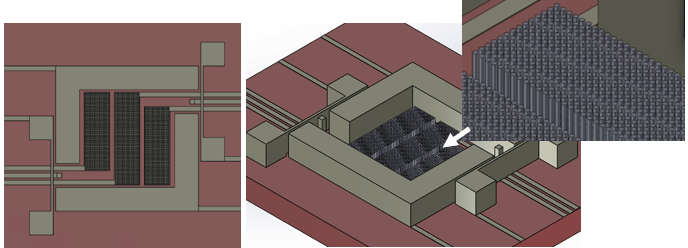

Type 1 Diabetes is a growing epidemic across the world, and without a cure currently available sophisticated means of administering insulin and monitoring blood glucose levels are needed to ensure that diabetics are healthy and have quality of life. Current glucose monitors are: invasive, have a lot of waste, are expensive, and need to be replaced, on average, every fourteen days. The invasiveness of the current sensors causes excessive scar tissue development which reduces effective insulin absorption and requires regular injections for diabetics. The majority of Type 1 diabetics are diagnosed in the juvenile stage of life; resulting in juveniles having to constantly use needles causing a severe impact on quality of life. This project successfully proposed and showed successful glucose measurements of a MEMS-fabricated, flexible sweat sensor. This sensor is coated with adhesives making it able to be applied to many areas and generate sweat efficiently; it is also not limited to a short enzyme life span which allows it to be used for an above-average time frame. The overall design and results from this project reflect on the next generation of glucose monitors that bring diabetics one step closer to having an autonomous and minimally invasive way of managing their diabetes.

Source: <a href="MEMS_Project_Report.pdf">MEMS Fabricated, Flexible Glucose Sweat Sensor</a>
