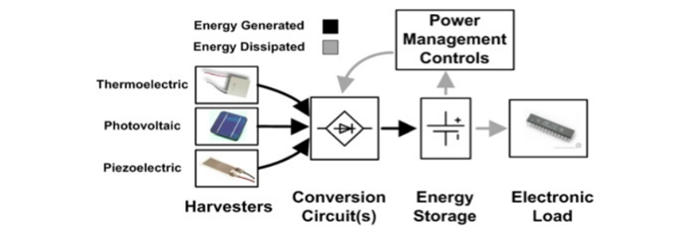

In this work, authors designed an optimized structure of power-generating shoe soles for energy harvesting technology based on piezoelectric and triboelectric effects using COMSOL multiphysics. This work gives a basic review of the structural layout and performance evaluation of various piezoelectric and triboelectric materials used as energy-generating layers for shoe soles. In this study, the device structure is optimized by the method of contact electrification. Various piezoelectric and triboelectric materials are used as energy-generating layers for the shoe sole and a comparative study on the effect of these materials on different structures was also carried out. Electric fields and potential voltages generated by these materials were studied by varying the gap between the structures. In this work, we also build a prototype for the nanogenerator model. It involves fabrication using the materials and completing the circuit necessary for harvesting, converting the energy, and storing it in a capacitor. The dimensions of the actual nanogenerator model are slightly reduced for the prototype model.

 
Source: <a href="Piezo-Tribo Nanogenerator (PTNG) for Powering Wearable Electronic Gadgets.pdf">Piezo-Tribo Nanogenerator (PTNG) for Powering
Wearable Electronic Gadgets</a>
