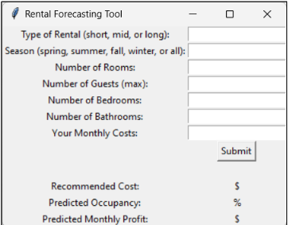

As part of a collaborative team project at Virginia Tech, I developed a Rental Forecasting Tool designed to predict rental demand and dynamic pricing for various rental properties. This project was sponsored by Black Dog Estates and aimed to support their business expansion in short-term, mid-term, and long-term rentals.

Project Highlights:

Predictive Analytics:     Utilized advanced statistical methods to forecast occupancy rates and potential profits.
Dynamic Pricing:          Developed algorithms to recommend optimal rental pricing based on historical data.
User-Friendly Interface:  Ensured an intuitive and accessible user interface to display forecast data and pricing recommendations.
Collaboration:            Worked closely with a multidisciplinary team to ensure project delivery met stakeholder expectations and project goals.

Source: <a href="rentalforecast.pdf">Rental Forecasting Tool</a>
